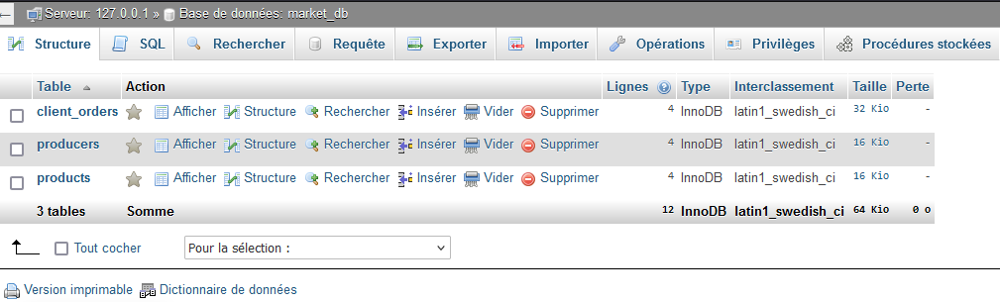
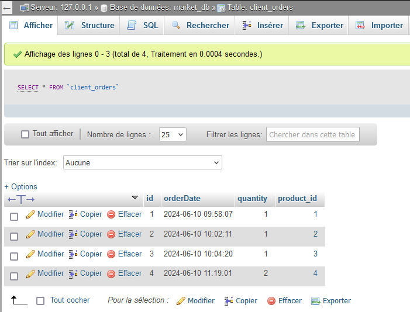
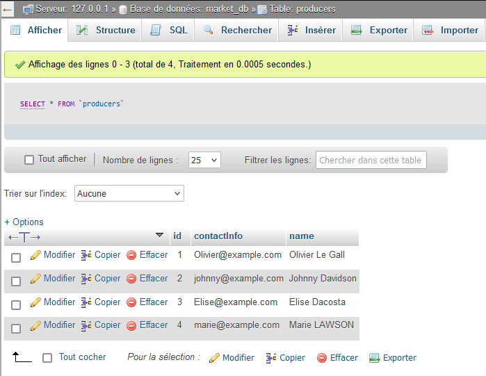
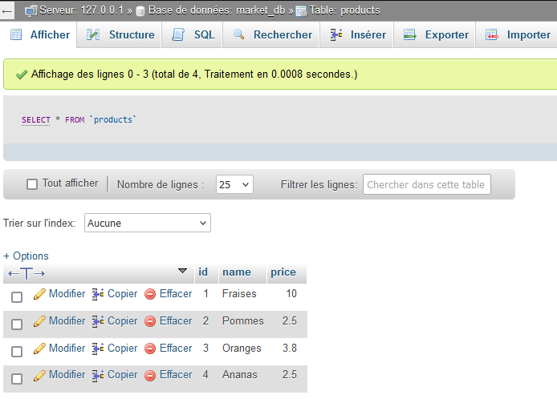

# Application de Gestion de Marché Local du Finistère:  

## Description du projet:  

Ce projet consiste à créer une application de gestion de marché local pour promouvoir l'économie locale du Finistère.  
L'application permettra de gérer les producteurs locaux, les produits qu'ils proposent, et les commandes des clients.  
L'objectif est de consolider vos connaissances en POO, gestion des exceptions, threads, MVC, DAO, et connexion à une base de données MySQL avec Hibernate.  
  
## Structure de dossiers et fichiers:

```CSS
src/
└── main/
    ├── java/
    │   └── org/
    │       └── example/
    │           ├── model/
    │           │   ├── Producer.java
    │           │   ├── Product.java
    │           │   ├── ClientOrder.java
    │           │   └── Market.java
    │           ├── dao/
    │           │   ├── ProducerDAO.java
    │           │   ├── ProductDAO.java
    │           │   └── ClientOrderDAO.java
    │           ├── controller/
    │           │   └── MarketController.java
    │           ├── utils/
    │           │   ├── HibernateUtil.java
    │           │   └── Exceptions.java
    │           └── view/
    │               └── Main.java
    └── resources/
        └── hibernate.cfg.xml

```
# Screenshots:  
- La base de données dans PhpMyAdmin:
  
  

- Les tables dans PhpMyAdmin:
  
    
  
    
  
  

  
